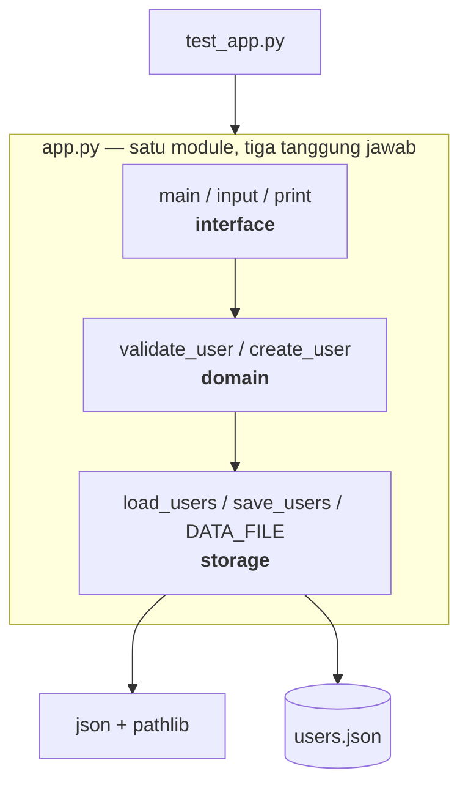
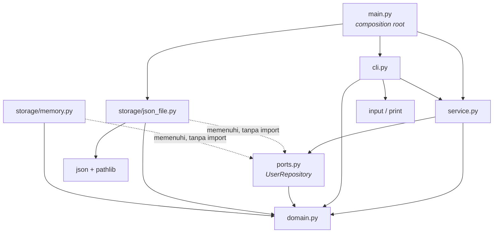

# Refactor `monolith_app` — Memisahkan Domain, Storage, dan Interface

**Universitas Cakrawala** · **Tugas Kelompok**

Anggota Kelompok:
- HALIMAH SUKMAWATY — 25120300037
- KEVIN APRIANTO — 25120300004
- RIDHO MARWANSYAH — 25120300020
- MUHAMMAD AZHAR KHAIRA — 25120300010

Titik awal: satu berkas `app.py` (62 baris) yang mencampur tiga tanggung jawab — aturan bisnis,
penyimpanan berkas JSON, dan antarmuka terminal. Hasil akhir: enam module (plus satu titik masuk)
dengan arah ketergantungan yang dijaga oleh test.

```bash
python3 main.py      # jalankan aplikasi
python3 -m pytest    # 44 test, semuanya lulus
```

---

## 1. Struktur Akhir

```
monolith_app/
├── main.py                        # composition root: merakit adapter + service + CLI
├── pytest.ini
├── users.json                     # data (tidak berubah)
├── user_management/
│   ├── domain.py                  # aturan bisnis murni — tanpa I/O
│   ├── ports.py                   # kontrak UserRepository (interface storage)
│   ├── service.py                 # use case: create_user, list_users
│   ├── cli.py                     # antarmuka terminal
│   └── storage/                   # adapter — implementasi konkret port
│       ├── json_file.py           # penyimpanan berkas JSON
│       └── memory.py              # penyimpanan di memori (untuk uji)
└── tests/
    ├── test_domain.py             # aturan bisnis, tanpa berkas
    ├── test_service.py            # use case, tanpa berkas
    ├── test_storage_contract.py   # kontrak yang harus dipenuhi SEMUA adapter
    ├── test_json_file_repository.py
    ├── test_cli.py                # antarmuka, tanpa stdin/stdout sungguhan
    └── test_arah_dependensi.py    # menjaga peta dependensi di bagian 3
```

| Berkas | Baris | Tanggung jawab tunggalnya |
| :--- | ---: | :--- |
| `domain.py` | 83 | Apa yang sah disebut user, dan siapa yang boleh mendaftar |
| `ports.py` | 29 | Apa yang dijanjikan sebuah penyimpanan |
| `service.py` | 35 | Urutan langkah sebuah use case |
| `cli.py` | 43 | Menanya, menampilkan, menentukan kode keluar |
| `storage/json_file.py` | 50 | Cara menulis dan membaca berkas JSON |
| `storage/memory.py` | 27 | Penyimpanan sementara di memori |
| `main.py` | 28 | Memilih adapter dan merakit aplikasi |

---

## 2. Peta Dependensi — SEBELUM



Versi teks:

```
test_app.py ──► app.py ──► json, pathlib ──► users.json
                  └─ interface  ──► domain ──► storage   (semua di dalam satu berkas)
```

Yang perlu dicatat dari peta ini: **bukan tidak ada dependensi, melainkan dependensinya
tersembunyi dan arahnya terbalik.**

| Ketergantungan tersembunyi | Bukti di kode awal |
| :--- | :--- |
| Domain → storage | `create_user()` memanggil `load_users()` dan `save_users()` (`app.py:34,42`) |
| Storage → konstanta global | `DATA_FILE = Path("users.json")` di tingkat module (`app.py:4`), relatif terhadap direktori kerja |
| Test → berkas sungguhan | `import app` ikut memuat `json`, `pathlib`, dan `DATA_FILE` walau yang diuji hanya validasi |
| Interface → segalanya | `main()` memanggil `create_user()` yang menulis berkas; tidak ada cara mencobanya tanpa menulis |

Akibat paling nyata ada di test bawaan: **starter hanya menguji `validate_user`.** Itu bukan
kebetulan — `validate_user` satu-satunya fungsi yang tidak menyentuh disk. Menguji `create_user`
berarti menimpa `users.json` sungguhan pada setiap kali test dijalankan. Strukturnya sendiri yang
membatasi apa yang bisa diuji.

---

## 3. Peta Dependensi — SESUDAH



Versi teks — panah selalu mengarah ke dalam, tidak pernah keluar:

```
        main.py  (satu-satunya yang tahu adapter konkret)
           │
   ┌───────┼─────────────────────────────┐
   ▼       ▼                             ▼
 cli.py ─► service.py ─► ports.py ◄╌╌ storage/json_file.py
   │           │            │       ╌╌ storage/memory.py
   └───────────┴────────────┴────────────┘
                     ▼
                 domain.py        ◄── tidak punya panah keluar sama sekali
```

| Module | Boleh mengimpor | Tidak boleh mengimpor |
| :--- | :--- | :--- |
| `domain.py` | — (hanya pustaka standar) | apa pun dari paket ini |
| `ports.py` | `domain` | `service`, `cli`, `storage` |
| `service.py` | `domain`, `ports` | `storage`, `cli` |
| `cli.py` | `domain`, `ports`, `service` | `storage` |
| `storage/*.py` | `domain`, `ports` | `service`, `cli` |
| `main.py` | semuanya | — |

Aturan ini bukan sekadar niat baik di dokumen: `tests/test_arah_dependensi.py` membaca setiap
`import` dengan modul `ast` dan menolak panah yang keluar jalur. Saat ditambahkan satu baris
`from user_management.storage.json_file import ...` ke `domain.py` sebagai percobaan, test langsung
gagal dengan pesan *"user_management.domain tidak boleh mengimpor ['user_management.storage.json_file']"*.

---

## 4. Bagaimana Dependensi Berubah

**a. Arah panah domain↔storage dibalik.** Sebelumnya `create_user` (domain) memanggil `save_users`
(storage) — lapisan aturan bisnis bergantung pada detail teknis. Sesudahnya `domain.register()`
hanya menerima daftar user sebagai *nilai* dan mengembalikan user baru; yang membaca dan menulis
adalah `service`, lewat kontrak `UserRepository`. Domain tidak lagi tahu bahwa berkas itu ada.

**b. Ketergantungan konkret berubah jadi ketergantungan abstrak.** `service.py` tidak pernah
menyebut `JsonFileUserRepository`. Ia hanya tahu ada sesuatu dengan `list_all()` dan `add()`.
Adapter-lah yang menyesuaikan diri ke kontrak, bukan pemakai yang menyesuaikan diri ke adapter —
inilah *dependency inversion*: keduanya kini bergantung pada `ports.py`, yang lebih stabil daripada
keduanya.

**c. Keputusan "pakai penyimpanan apa" naik ke satu titik.** Dulu tersebar sebagai konstanta module
`DATA_FILE` yang mengikat seluruh berkas. Sekarang hanya ada di `main.py`. Baris yang menentukan
seluruh nasib penyimpanan tinggal satu:

```python
repository = JsonFileUserRepository(DATA_FILE)
```

**d. Ketergantungan pustaka jadi terlokalisasi.** `json` dan `pathlib` kini hanya diimpor oleh
`storage/json_file.py`; `input`/`print` hanya dipakai `cli.py`. Impor sebuah module sekarang
menunjukkan tanggung jawabnya.

**e. Test tidak lagi mewarisi dependensi yang tidak diperlukannya.** `test_domain.py` mengimpor
`domain` saja — tidak ada `json`, `pathlib`, maupun `users.json` yang ikut terbawa. Dari 44 test:
24 berjalan murni di memori, 11 menyentuh berkas data (selalu lewat `tmp_path`, tidak pernah
`users.json` asli), dan 9 sisanya membaca kode sumber untuk memeriksa arah impor.

| | Sebelum | Sesudah |
| :--- | :--- | :--- |
| Module aplikasi | 1 (tiga tanggung jawab) | 6 (satu tanggung jawab masing-masing) |
| Panah dependensi yang salah arah | 1 (domain → storage) | 0 |
| Module yang tahu format JSON | 1 dari 1 (100%) | 1 dari 6 |
| Module yang tahu lokasi berkas data | 1 dari 1 | 1 (`main.py`) |
| Fungsi yang bisa diuji tanpa menyentuh disk | 1 dari 5 | semuanya |
| Test yang menulis ke `users.json` asli saat dijalankan | akan menulis | 0 |
| Jumlah test | 2 | 44 |

---

## 5. Alasan Pembagian Module

Pembagiannya mengikuti satu pertanyaan: **apa yang membuat berkas ini harus diubah?** Dua hal yang
berubah karena alasan berbeda tidak diletakkan dalam satu berkas.

| Module | Berubah kalau… | Karena itu dipisah |
| :--- | :--- | :--- |
| `domain.py` | aturan bisnis berubah (misal email wajib domain kampus) | Aturan bisnis paling lama umurnya dan paling sering diuji. Ia tidak boleh ikut rusak gara-gara ganti database |
| `ports.py` | kebutuhan use case atas penyimpanan berubah | Kontrak adalah batas antar-lapisan. Dipisahkan supaya kedua sisi bisa berubah sendiri-sendiri tanpa saling menunggu |
| `service.py` | urutan langkah use case berubah | Orkestrasi adalah tanggung jawab tersendiri: ia tahu *urutan*, bukan *aturan* maupun *cara menyimpan* |
| `storage/json_file.py` | format atau lokasi penyimpanan berubah | Detail teknis paling sering berganti. Dikurung di satu berkas supaya perubahannya tidak menjalar |
| `cli.py` | tampilan atau cara berinteraksi berubah | Terminal hanyalah salah satu antarmuka. Kalau nanti ada web, ia jadi tetangga `cli.py`, bukan penggantinya |
| `main.py` | pilihan teknologi berubah | Seluruh keputusan perakitan dikumpulkan di satu tempat agar mudah ditemukan |

Yang **tidak** dipecah juga disengaja: `validate_user`, `is_email_taken`, `next_user_id`, dan
`register` tetap satu berkas karena semuanya berubah karena alasan yang sama — perubahan aturan
bisnis user. Memecah per fungsi hanya menambah berkas tanpa menambah kejelasan.

### Arah dependensi: kenapa ke dalam

Panah dependensi mengarah dari yang **sering berubah** ke yang **jarang berubah**. Format JSON bisa
diganti SQLite tahun depan; terminal bisa diganti web; tetapi "nama tidak boleh kosong" dan "email
harus unik" akan bertahan selama aplikasinya hidup. Karena itu domain diletakkan di pusat dan tidak
diberi satu pun panah keluar — supaya perubahan di tepi tidak pernah merambat ke tengah.

---

## 6. Interface Storage dan Adapter-nya

```python
@runtime_checkable
class UserRepository(Protocol):
    def list_all(self) -> List[User]: ...
    def add(self, user: User) -> None: ...
```

Tiga keputusan di baliknya:

1. **Hanya dua operasi.** Sengaja sekecil mungkin — hanya yang benar-benar dipakai use case. Makin
   kecil kontraknya, makin murah membuat adapter baru. Operasi seperti `save_all()` sengaja tidak
   ada, karena akan memaksa pemanggil memikirkan "menimpa seluruh berkas" — itu detail berkas.
2. **`Protocol`, bukan kelas induk (ABC).** Dengan `Protocol`, adapter tidak perlu mewarisi apa pun;
   cukup punya dua metode itu. Artinya tidak ada satu pun panah dari adapter yang *wajib* menuju
   `ports.py`, dan kelas dari pustaka pihak ketiga pun bisa dipakai sebagai adapter tanpa dibungkus.
3. **`User`, bukan `dict`.** Kontraknya berbicara dalam bahasa domain. Penerjemahan
   `User` ↔ `{"id": ..., "name": ..., "email": ...}` hanya ada di `storage/json_file.py`
   (fungsi `_to_user` dan `_to_row`). Nama kunci JSON tidak bocor ke mana-mana.

Dua adapter disediakan: `JsonFileUserRepository` (dipakai aplikasi) dan `InMemoryUserRepository`
(dipakai test). Keberadaan yang kedua adalah buktinya — kalau `service` masih diam-diam terikat
berkas, adapter memori tidak akan bisa menggantikannya.

---

## 7. Perubahan pada Test

Test lama (2 buah, keduanya menguji `validate_user`) tetap hidup — pindah ke `test_domain.py`
dengan maksud yang sama, supaya bisa dilacak:

| Test awal | Sekarang | Perubahan |
| :--- | :--- | :--- |
| `test_validate_user` | `test_validate_user_merapikan_spasi_dan_huruf_besar` | Hasil dibandingkan ke `User(...)`, bukan `dict` |
| `test_invalid_email` | `test_email_tanpa_at_ditolak` | `try/except` + `assert False` diganti `pytest.raises` — kalau exception-nya tidak muncul, pytest yang melaporkannya, bukan `assert False` yang mudah terlewat |

Sisanya adalah test yang **sebelumnya mustahil ditulis tanpa menyentuh `users.json` sungguhan**:

| Berkas | Isi | Menyentuh disk? |
| :--- | :--- | :--- |
| `test_domain.py` (11) | validasi, duplikat, penomoran id, koleksi masukan tidak diubah | tidak |
| `test_service.py` (5) | alur use case, termasuk "masukan tidak valid tidak boleh sampai ke `add()`" | tidak |
| `test_storage_contract.py` (10 = 5×2) | satu berkas kontrak, dijalankan untuk **kedua** adapter | hanya adapter JSON, lewat `tmp_path` |
| `test_json_file_repository.py` (6) | berkas belum ada, format `indent=2`, isi lama tidak tertimpa, non-ASCII | ya, `tmp_path` |
| `test_cli.py` (3) | alur sukses dan dua alur gagal, dengan `input`/`print` palsu | tidak |
| `test_arah_dependensi.py` (9) | peta dependensi bagian 3 dijaga otomatis | membaca kode sumber, tidak menulis |

Dua hal yang paling berubah cara ujinya:

- **Use case bisa diuji tanpa berkas.** `UserService(InMemoryUserRepository())` — tidak perlu
  `tmp_path`, tidak perlu `monkeypatch`, tidak perlu membersihkan apa pun setelahnya. Tidak ada satu
  pun `mock` di seluruh suite; yang dipakai adalah implementasi sungguhan yang kebetulan sederhana.
- **Satu kontrak diuji untuk semua adapter.** `test_storage_contract.py` dijalankan dua kali lewat
  `@pytest.fixture(params=[...])`. Adapter baru cukup ditambahkan satu baris di fixture itu; kalau
  lolos, `UserService` dijamin tetap bekerja di atasnya.

```
$ python3 -m pytest -q
............................................                             [100%]
44 passed in 0.07s
```

---

## 8. Manfaat Struktur Akhir

Diukur dengan pertanyaan yang sama untuk kedua versi: **berapa berkas yang harus disentuh?**

| Perubahan | Sebelum | Sesudah |
| :--- | :--- | :--- |
| Ganti JSON → SQLite | bongkar `app.py`, semua test ikut terdampak | 1 adapter baru + 1 baris di `main.py`; `domain`, `ports`, `service`, `cli` tidak disentuh |
| Tambah antarmuka web | tidak mungkin tanpa menyalin logika | modul baru di sebelah `cli.py`, `service` dipakai ulang apa adanya |
| Tambah aturan "email wajib @upi.edu" | edit di tengah berkas yang juga mengurus berkas dan terminal | `domain.py` saja, ujinya juga di `domain` saja |
| Jalankan test | akan menulis `users.json` sungguhan | 24 test murni di memori, 11 sisanya hanya lewat `tmp_path` |
| Menjawab "di mana aturan email diperiksa?" | baca seluruh berkas | `domain.py`, satu fungsi |

Manfaat yang kurang terlihat tapi paling terasa saat dikerjakan: **letak sebuah kode jadi punya
alasan.** Ketika muncul kebutuhan baru, pertanyaannya bukan lagi "ditaruh di baris berapa" melainkan
"ini aturan bisnis, cara menyimpan, atau cara menampilkan?" — dan jawabannya menentukan berkasnya.

---

## 9. Perubahan Perilaku yang Disengaja

Refactor idealnya tidak mengubah perilaku. Empat hal berikut tetap berubah, dan sebaiknya diketahui
penguji:

| Perubahan | Sebelum | Sesudah | Alasan |
| :--- | :--- | :--- | :--- |
| Format keluaran sukses | `User created: {'name': 'Alice', ...}` | `User created: #4 Alice <alice@example.com>` | `User` kini dataclass, bukan dict; sekalian dibuat terbaca manusia |
| Kode keluar saat gagal | selalu `0` | `1` untuk masukan tidak valid | Supaya bisa dipakai di skrip/pipeline |
| Lokasi `users.json` | relatif direktori kerja | relatif `main.py` | `python3 /path/ke/main.py` dari mana pun kini menulis ke berkas yang sama |
| Urutan kunci JSON user baru | `name, email, id` | `id, name, email` | Menyamakan dengan isi `users.json` yang sudah ada |

Yang **tidak** berubah: pesan error (`"Name cannot be empty"`, `"Invalid email"`,
`"Email already exists"`), aturan validasi, penomoran id, dan format berkas `indent=2`. Pesan error
juga tetap bisa ditangkap dengan `except ValueError` — `ValidationError` dan `DuplicateEmailError`
diturunkan dari `ValueError`.

---

## 10. Temuan di Luar Scope (tidak diperbaiki di tugas ini)

Empat hal ditemukan saat membaca kode awal. Semuanya **dibiarkan apa adanya** supaya refactor ini
tetap bisa diklaim "struktur berubah, perilaku tidak" — tetapi dicatat agar tidak hilang:

1. **`next_user_id` memakai `len(users) + 1`.** Aman selama tidak ada fitur hapus user; begitu ada,
   id bisa bentrok. Perbaikannya: `max(id) + 1` atau UUID.
2. **`list_users()` tidak punya pintu masuk dari CLI.** Sudah ada sejak kode awal dan tidak pernah
   dipanggil. Setelah refactor, menambahkannya cukup menyentuh `cli.py`.
3. **Baca-ubah-tulis tanpa penguncian.** Dua proses yang menambah user bersamaan bisa saling
   menimpa. Wajar untuk aplikasi latihan; kalau nanti serius, adapter perlu penulisan atomik
   (tulis ke berkas sementara lalu `replace`).
4. **Berkas JSON rusak akan melempar `json.JSONDecodeError` mentah.** Sebaiknya diterjemahkan
   adapter menjadi error yang punya arti bagi pemanggil.
